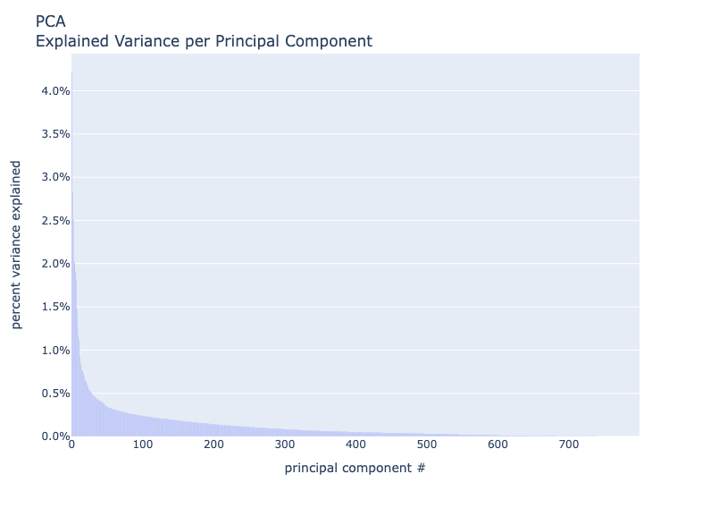
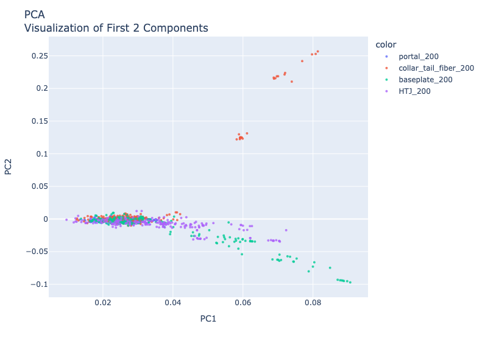
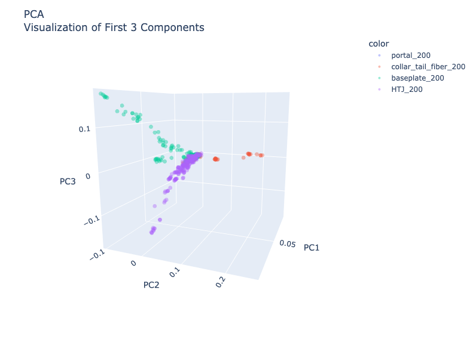
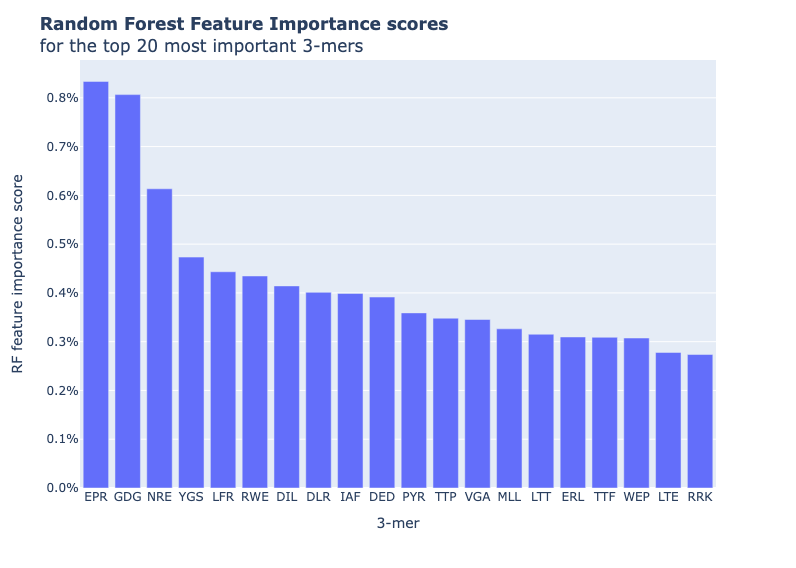

# Bio668
[Bio668](https://kelleybioinfo.org/algorithms/about/about.php) @ SDSU final project submission

### <u>Sections</u>
- [Bio668](#bio668)
- [Assignment](#assignment)
- [Setup](#setup)
- [Input Data](#input-data)
- [Scripts](#scripts)
- [Output](#output)

<hr>

## Assignment 

Due May 11th 2023

1. Work on something relevant to your research project, or something that interests you. This part is very flexible.
2. Use things we covered in the semester (**bash**, **awk**, sed, **python**, regex, r, qiime2, etc.).
3. Preferably do it in a notebook format.

<hr>

## Setup
Navigate to the directory you want to store the code and plots in. Then run the following commands to create a virtual 
environment:

```bash 
git clone https://github.com/seanfahey1/Bio668.git
```

```bash 
cd Bio668
```

```bash 
./setup.sh
```

Next, add additional .fasta formatted files to the `sequences` directory (or remove unwanted files).

Finally, run the following command to produce the 3-mer PCA plots:

```bash 
./pca-of-kmers.py
```

<hr>

## Input Data

Four `.fasta` files are included for different classifications of phage structural proteins. These can be substituted 
for any fasta formatted files of protein sequences. The title of the file will be used for the color labels and legend 
of the output plots. 

<hr>

## Scripts

#### `setup.sh`
- _Optional installation script._
- A bash script that creates a virtual environment for the project and installs all necessary requirements (tested 
using python 3.10.7. Should work for any python >= 3.10.1)


#### `get-kmers.sh`
- A bash script that uses `awk` and `grep` to extract each 3-mer moving window from an input string.
- Offloading the 3-mer solving to bash sped the code up significantly, when compared to running this step in python.
- Can be run as a stand-alone script, but is intended to be called by the `pca_of_kmers.py` python script.


#### `pca_of_kmers.py`
- Extracts the sequence and header information from input `.fasta` files in the `sequences` directory using biopython 
SeqIO
- Calls `get-kmers.sh` using subprocess to find all 3-mers from each input sequence over a sliding window.
- Calculates the relative frequency of each 3-mer.
- Fits a PCA to the relative 3-mer frequency array.
- Generates plot outputs (using plotly):
  - __Bar plot__ of the % variance explained by each principal component.
  - __Scatter plot__ of the first 2 principal components, colored by the source file and labeled by the sequence header.
  - __3D scatter plot__ the first 3 principal components, colored by the source file and labeled by the sequence header.
- All plots generated are saved as `.html` files in the `plots` directory.


#### `Fahey_Final.ipynb`
- A Jupyter notebook that wraps the functions from `pca_of_kmers.py` into a notebook format for ease of use. 
- Additional steps included in the Jupyter notebook that are not found in the python file:
  - Fits a random forest model to a random sample of 80% of the data. Then predicts the remaining 20% using the model. 
This prediction has an ~89% accuracy for the sample files provided.
  - Re-fits the model using 100% of available sequence data and calculates the feature importance scores for each 
3-mer. Then plots the 20 most important 3-mer frequencies for the model, annotated with the 3-mer and the side chain 
functional group category for each amino acid.
  - Saves the plot `.html` file locally.

<hr>

## Output

The python code opens each `.fasta` file in the `sequences` directory and calls the `get-kmers.sh` shell script. This 
collects a list of all 3-mers present in each sequence present in the file using a sliding window. The relative 
frequency of each 3-mer is then calculated for each sequence provided. These relative frequencies are then fit to a 
[PCA](https://scikit-learn.org/stable/modules/generated/sklearn.decomposition.PCA.html). 

The output of this code is 4 plots (produced using [plotly.express](https://plotly.com/python/plotly-express/)) that 
can be found in the `plots` folder:

- `variance-per-component.html` - A bar plot of the % of variance explained by each principal component.

[](https://github.com/seanfahey1/Bio668/blob/598fb271eb19d9f9aca7d48a86718f398dfa74c4/images/PCA-variance.png)

- `2D-PCA.html` - The first 2 principal components.

[](https://github.com/seanfahey1/Bio668/blob/598fb271eb19d9f9aca7d48a86718f398dfa74c4/images/2D-PCA.png)


- `3D-PCA.html` - The first 3 principal components plotted in a 3D scatterplot.

[](https://github.com/seanfahey1/Bio668/blob/598fb271eb19d9f9aca7d48a86718f398dfa74c4/images/3D-PCA.png)

- `random-forest-scores.html` - The 20 most important 3-mer frequencies for the model as determined by random forest
feature importance score, annotated with the corresponding 3-mer and the side chain functional group category for each 
amino acid.

[](https://github.com/seanfahey1/Bio668/blob/598fb271eb19d9f9aca7d48a86718f398dfa74c4/images/RF-importance.png)

